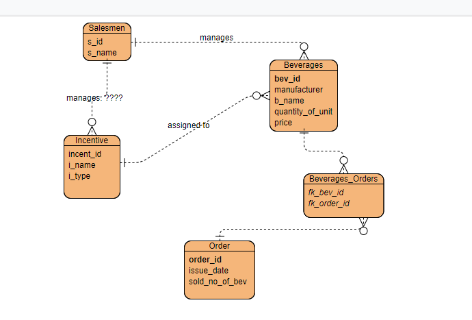

# Project BeverageStore

**Table of Contents**  
- [Installation](#installation)
    - [PostgreSQL](#postgresql-database)
    - [Build project](#build-project)
    - [Schema](#schema-)
- [Description](#description)
- [Teamwork](#teamwork)
    - [Development steps](#development-steps)

## Project Overview

- `backend/beans` includes the business functionality of the demo application
- `client` includes the JSP frontend to add beverages, create orders, and manage incentives
- `queuefiller` includes a JSP frontend for sending orders to the JMS queue that will be persisted by the MDB of the `ejb` project
- `ear` creates an EAR from all the subprojects for deployment inside Glassfish
- `shared` includes all classes/interfaces that are used by the other projects

## Installation

Minimal setup:

- Execute the global build via `gradlew build`
- Deploy the EAR from `ear/build/libs` inside Glassfish, e.g., copy to `%GLASSFISH_HOME%\glassfish\domains\domain1\autodeploy`
- Open `http://localhost:8080/frontend` to see the initial UI of the frontend project

#### PostgreSQL Database
   1. Setup Postgres Database driver:
   Get the correct JDBC driver JAR for your PostgreSQL version from https://jdbc.postgresql.org/
   Copy `resources/postgresql-*.*.****.jar` inside `[GlassFish directory]/glassfish/domains/[domain dir]/lib/`

   2. Setup of Postgres Database:
   [PostGres directory]/pgAdmin4/bin/pgAdmin4.exe (default password: admin)
   Add new login role (you have to use a password as GlassFish JDBC Resources will require one) [Name: tester, Password: tester, Privileges: can_login: true]
   Add new database [Name: BeverageStore, Owner: tester]

#### Build project

1. Check settings in `gradle.properties`, especially the path to Glassfish.  
Default path : **c:/glassfish5/glassfish**

2. In the project's root folder:
Run target `gradlew startGlassfish`
Run target `gradlew initServer`
Run target `gradlew build`
Run target `gradlew deploy`

### Setup JMS queue in GlassFish
        - Setup connection factory
              - Resources -> JMS Resources -> Connection Factories
              - Pool Name: BeverageStoreCF
              - Resource Type: javax.jms.QueueConnectionFactory
              - Configure XATransaction Support for this factory
        - Setup destination  
              - Resources -> JMS Resources -> Destination Resources
              - JNDI Name: BeverageStoreQueue
              - Physical Destination Name: PhysicalQueue
              - Resource Type: javax.jms.Queue

### Schema :

## Description
Stateless EJBs for business logic and Servlets for request-response are used in this Project. JSP Pages are used to create GUI pages. JPA is used for PostGreSQL Database.

Important Notes:
1. It is required to build and deploy the project for it to work
2. Go to create beverage to see all the options (Create new incentive, manage incentives)
3. It is not allowed to edit the incentive type, it remains what it has been set the first time, you can only edit the name
4. Click on user to add an order and click on Salesman to create beverages, create incentives, manage incentives and check the revenue
5. In orders, click on 'Buy' which confirms that you buy that beverage. After selecting your beverages, you click save to confirm the entire order.
6. Please make sure, you don't have two beverages of the same name, we didn't do any validation for that
7. Please add data for checking the functionalities
8. Assign incentive is not working and so, we could not generate revenue for Trial Package and Promotional Gift

Reasons behind using Stateless and/or Stateful?
We used Stateless for BeverageManagementBean, IncentiveManagementBean and OrderMessageBean because we did not have to preserve any state on the 
client side. We don't have any specific client so we don't have instance state for a specific client. Every operation is a one-time operation, we 
don't save the state of any operation and use it later for something.

